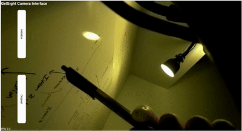

# pyStreamer

Alan Zhao

### What this does
It takes the video stream from the connected pi camera (with all settings modifiable, e.g. iso, awb gains, exposure, brightness), through opencv and flask.

It has a web interface, where users can switch between different modes (original color, color diff., mono diff -> i.e. red channel minus the green channel of the color diff.), and reset the initial frame used for difference images.

### What are the benefits
1. Better interface
2. It does not depent on `mjpg-streamer`, which is outdated and requires a really old version of raspbian `buster`. 

### On what platform have I tested it
Pi 4 only for now. Without any post-processing (streaming the original color images), it can reaches 25fps (most likely because the camera is 25fps). 
With post-processing, because calculating the difference images involves changing matrix data types from uint8 to a larger container, the frame rate drops to ~9fps.

On a computer browser:

On a pi screen:

